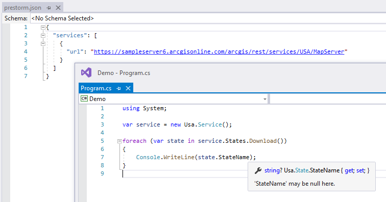

# PreStormCore

- .NET 5.0
- Generally compatible with the original PreStorm (but not quite)
- Linux, Mac and Windows
- Nullable reference type support
- Optional domain to enum mapping
- Tooling support via Source Generator

